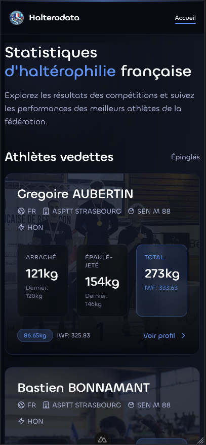

<p align="center">
    
</p>

<h1 align="center">Halterodata's Front-end</h1>

<p align="center"></p>

<hr>

# Description

This project is a front-end for the Halterodata Front-End, done using Nuxt 4, and will be running live on [this site](https://halterodata.valentinvirot.fr/).

Data is directly coming from the [Halterodata-POC API](https://halterodata-api.valentinvirot.fr/swagger).

## How to run it?

```bash
npm ci
npm run dev
```

The Dockerfile is a multi-stage build and exposes port 3000:

```bash
docker build -t halterodata-front .
docker run -p 3000:3000 halterodata-front
```

Set `NUXT_PUBLIC_API_BASE_URL` to point at another API instance (see
`.env.example`).

## Quality checks

| Command                | Purpose                                     |
| ---------------------- | ------------------------------------------- |
| `npm run lint`         | ESLint (Nuxt config + project rules)        |
| `npm run format:check` | Prettier, including Tailwind class ordering |
| `npm run typecheck`    | `vue-tsc` in strict mode                    |
| `npm test`             | Vitest (Nuxt environment)                   |
| `npm run docs:check`   | Instruction files still in sync             |

CI runs all of the above plus the build on every pull request.

## Contributing

Architecture rules, project structure and known API constraints live in
`CLAUDE.md` / `CURSOR.md` / `.github/copilot-instructions.md`. All three are
**generated** from `docs/instructions.template.md` — edit that file and run
`npm run docs:sync`; CI fails if they drift.

## Can I use it for my own?

If this repo is public, you can clone/fork my project and use it for your own website. Just credit me somewhere in your site, as a thanks for my work :)

You can contact me using my [Portfolio](https://www.valentinvirot.fr), if you have some question about it. Have fun!
